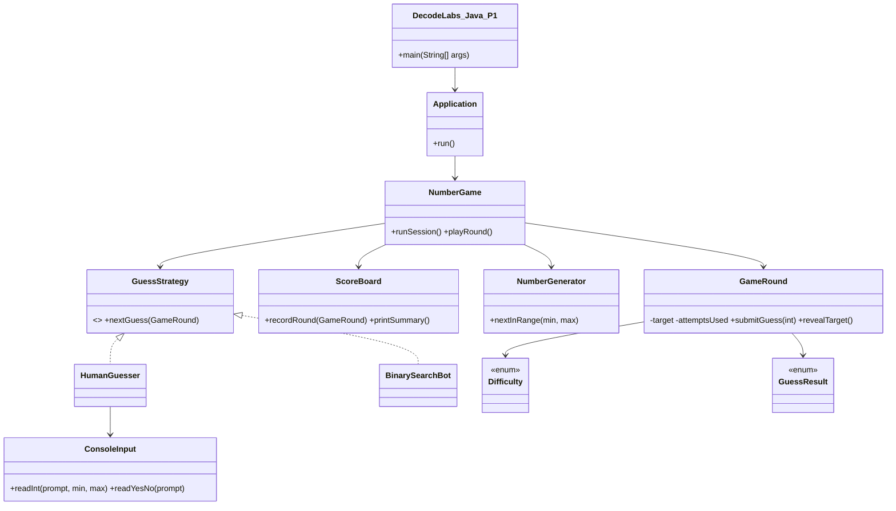

# 🎯 Number Guessing Game: Engineering a Random Logic Engine

[](https://github.com/YOUR-USERNAME/decodelabs-java-p1-number-game/actions/workflows/build.yml)


**DecodeLabs Industrial Training Kit | Java Programming | Project 1**

A crash-proof, object-oriented console game. The computer picks a hidden random number, you guess it, and the engine gives instant **Too High / Too Low** feedback in a live loop until you win (or run out of attempts).

## ✅ Requirement Checklist

Every item from the project brief, and where it lives in the code.

| Requirement (from the brief) | Status | Implementation |
|---|:---:|---|
| Generate a random number using Java utilities | ✅ | `NumberGenerator` wraps `java.util.Random` (no `Math.random()`) |
| Zero-index shift (`nextInt(100) + 1`) | ✅ | `random.nextInt(max - min + 1) + min` |
| Take user input for guesses | ✅ | `ConsoleInput.readInt()` using `java.util.Scanner` |
| "Too high" / "Too low" feedback | ✅ | `GuessResult` enum returned by `GameRound.submitGuess()` |
| Continue until the correct number is guessed | ✅ | Live loop in `NumberGame.playRound()` |
| **Scanner Trap** (leftover newline) | ✅ | `nextLine()` flush after every `nextInt()` |
| **Input validation** (`InputMismatchException`) | ✅ | `try-catch`, so typing `abc` never crashes the game |
| Limit the number of attempts | ✅ | Per-difficulty attempt counter in `GameRound` |
| Allow multiple rounds | ✅ | `do-while` loop, "Play again? [Y/N]" |
| Display the final score | ✅ | `ScoreBoard.printSummary()` |
| Binary search strategy (~7 guesses for 1-100) | ✅ | `BinarySearchBot`, proven for every number by the self-test |
| Clean code naming convention | ✅ | `DecodeLabs_Java_P1.java` |
| Logic audit | ✅ | `--selftest` flag, run automatically by GitHub Actions |

## 🚀 Quick Start

Requires **JDK 17 or newer**.

```bash
git clone https://github.com/YOUR-USERNAME/decodelabs-java-p1-number-game.git
cd decodelabs-java-p1-number-game

# Option A: compile, then run
javac -d out src/DecodeLabs_Java_P1.java
java -cp out DecodeLabs_Java_P1

# Option B: single-file launch (no compile step)
java src/DecodeLabs_Java_P1.java
```

Run the automated logic audit:

```bash
java -cp out DecodeLabs_Java_P1 --selftest
```

## 🎮 Sample Session

```text
============================================
   DECODELABS  |  JAVA PROGRAMMING  |  P1
        THE NUMBER GUESSING GAME
============================================

--------------------------------------------
New round - Classic (1-100, 7 attempts)
I'm thinking of a number between 1 and 100.
--------------------------------------------
Attempt 1/7 - guess (1-100): abc
Invalid input. Please enter a whole number (1-100).
Attempt 1/7 - guess (1-100): 50
Too high! Go lower.
Attempt 2/7 - guess (1-49): 25
Too high! Go lower.
Attempt 3/7 - guess (1-24): 12

Correct! You found 12 in 3 attempt(s).
Efficiency: binary-search level (optimal worst case is 7).
Points earned: +180 | Total score: 180 | Win streak: 1
```

## 🎚️ Difficulty Levels

| Level | Range | Attempts | Note |
|---|---|:---:|---|
| Easy | 1-50 | 10 | Relaxed |
| **Classic** | **1-100** | **7** | The brief's example; 7 is exactly the binary-search worst case |
| Hard | 1-1000 | 10 | Needs a perfect halving strategy |

Every level is winnable: the attempt limit is never lower than what binary search needs.

**Scoring:** 100 points per win + 20 points per unused attempt.

## 🧱 Object-Oriented Design



| OOP concept | Where |
|---|---|
| **Encapsulation** | `GameRound` keeps the target `private`; `revealTarget()` throws until the round ends |
| **Abstraction** | `GuessStrategy` hides *how* a guess is produced |
| **Polymorphism** | `NumberGame` runs a human or a bot through the same loop |
| **Enums with behavior** | `Difficulty` (range, attempts, optimal guesses) and `GuessResult` (message) |
| **Single Responsibility** | Model, strategy, I/O, engine and app layers are separate classes |
| **Custom exception** | `InputClosedException` allows a clean exit on Ctrl+D / Ctrl+Z |

## 🛡️ Defensive Engineering

- **Scanner Trap:** `nextInt()` leaves `\n` in the buffer, so a later `nextLine()` returns instantly. Every `nextInt()` is followed by a flush.
- **Bad input:** letters, decimals, overflowing numbers and empty lines are caught and re-prompted.
- **Range checks:** out-of-range guesses cost no attempt.
- **Duplicate guesses:** repeating a number costs no attempt.
- **Closed input stream:** exits gracefully instead of throwing a stack trace.
- **Overflow-safe math:** the bot uses `low + (high - low) / 2`.

## 📁 Project Structure

```text
decodelabs-java-p1-number-game/
├── .github/workflows/build.yml   # CI: compile + logic audit on every push
├── src/DecodeLabs_Java_P1.java   # the full game
├── .gitignore
├── LICENSE
└── README.md
```

## 🧠 Key Concepts

`java.util.Random` · loops (`while`, `do-while`) · conditionals · `Scanner` input handling · exception handling · enums · interfaces · encapsulation · polymorphism

## 👤 Author

**YOUR NAME**: DecodeLabs Java Programming Intern, Batch 2026
[GitHub](https://github.com/YOUR-USERNAME) · [LinkedIn](https://www.linkedin.com/in/YOUR-LINKEDIN)

## 📄 License

Released under the [MIT License](LICENSE).
